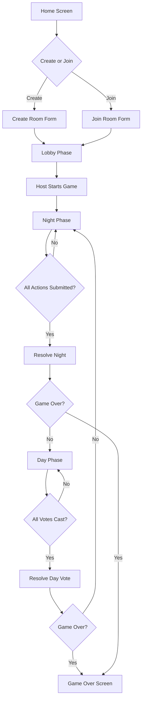

# Mafia Duel UI Redesign Plan
## Cyberpunk/Neon + Premium Casino Theme

---

## 🎯 Overview

Transform the Mafia Duel game into a visually stunning, buttery-smooth experience combining:
- **Cyberpunk/Neon aesthetics** - Glowing neon accents, particle effects, futuristic vibes
- **Premium Casino elegance** - Luxurious dark theme, gold accents, sophisticated feel

---

## 📊 Current State Analysis

### Game Flow


### Current UI Issues
1. **Inline styles** - Hard to maintain, no design system
2. **No animations** - Static, feels lifeless
3. **Basic layout** - Functional but not engaging
4. **No particle effects** - Missing visual depth
5. **Limited feedback** - No micro-interactions

---

## 🎨 Design System

### Color Palette

```css
/* Primary Neon Colors */
--neon-cyan: #00f5ff;
--neon-magenta: #ff00ff;
--neon-purple: #bf00ff;
--neon-gold: #ffd700;
--neon-red: #ff073a;
--neon-green: #39ff14;

/* Casino Luxury */
--casino-black: #0a0a0f;
--casino-dark: #12121a;
--casino-card: #1a1a2e;
--casino-gold: #d4af37;
--casino-silver: #c0c0c0;

/* Role Colors */
--role-mafia: #ff073a;
--role-villager: #6b7280;
--role-doctor: #39ff14;
--role-sheriff: #ffd700;

/* Phase Colors */
--phase-lobby: #8b5cf6;
--phase-night: #1e1b4b;
--phase-day: #fbbf24;
--phase-over: #10b981;
```

### Typography

```css
--font-display: 'Orbitron', sans-serif;      /* Futuristic headers */
--font-body: 'Inter', sans-serif;            /* Clean body text */
--font-mono: 'JetBrains Mono', monospace;    /* Technical data */
```

### Spacing & Radius

```css
--radius-sm: 8px;
--radius-md: 16px;
--radius-lg: 24px;
--radius-xl: 32px;
--radius-full: 9999px;
```

---

## 🧩 Component Architecture

### New File Structure
```
sgs_frontend/src/games/mafia-duel/
├── MafiaDuelGame.tsx          # Main game orchestrator
├── mafiaDuelService.ts        # Blockchain service
├── bindings.ts                # Soroban bindings
├── components/
│   ├── layout/
│   │   ├── GameLayout.tsx     # Animated background + particles
│   │   ├── Header.tsx         # Phase indicator with animations
│   │   └── Navigation.tsx     # Back button with effects
│   ├── screens/
│   │   ├── HomeScreen.tsx     # Create/Join with neon cards
│   │   ├── LobbyScreen.tsx    # Player slots with animations
│   │   ├── NightScreen.tsx    # Dark themed action panel
│   │   ├── DayScreen.tsx      # Voting interface
│   │   └── GameOverScreen.tsx # Dramatic reveal
│   ├── cards/
│   │   ├── RoleCard.tsx       # Animated role reveal
│   │   ├── PlayerCard.tsx     # Glowing player slot
│   │   └── ActionCard.tsx     # Neon action buttons
│   ├── effects/
│   │   ├── ParticleField.tsx  # Floating particles
│   │   ├── NeonGlow.tsx       # Reusable glow effect
│   │   ├── Scanline.tsx       # CRT scanline overlay
│   │   └── GlitchText.tsx     # Glitching text effect
│   └── ui/
│       ├── NeonButton.tsx     # Animated neon button
│       ├── NeonInput.tsx      # Glowing input field
│       ├── Toast.tsx          # Animated notifications
│       └── Badge.tsx          # Role/Status badges
├── hooks/
│   ├── useAnimations.ts       # Animation state management
│   └── useSoundEffects.ts     # Optional sound hooks
├── styles/
│   ├── animations.css         # Keyframe definitions
│   ├── effects.css            # Glow/shadow utilities
│   └── mafia-duel.css         # Component styles
└── utils/
    └── animationVariants.ts   # Framer Motion variants
```

---

## ✨ Animation Strategy

### Framer Motion Variants

```typescript
// Page transitions
const pageVariants = {
  initial: { opacity: 0, y: 20, scale: 0.98 },
  animate: { 
    opacity: 1, 
    y: 0, 
    scale: 1,
    transition: { duration: 0.5, ease: [0.22, 1, 0.36, 1] }
  },
  exit: { 
    opacity: 0, 
    y: -20, 
    scale: 0.98,
    transition: { duration: 0.3 }
  }
};

// Card hover effects
const cardVariants = {
  initial: { scale: 1, boxShadow: '0 0 0 rgba(0,245,255,0)' },
  hover: { 
    scale: 1.02, 
    boxShadow: '0 0 30px rgba(0,245,255,0.3)',
    transition: { duration: 0.2 }
  },
  tap: { scale: 0.98 }
};

// Stagger children
const containerVariants = {
  animate: {
    transition: {
      staggerChildren: 0.1
    }
  }
};

// Neon pulse
const neonPulse = {
  animate: {
    boxShadow: [
      '0 0 5px var(--neon-cyan), 0 0 10px var(--neon-cyan)',
      '0 0 20px var(--neon-cyan), 0 0 40px var(--neon-cyan)',
      '0 0 5px var(--neon-cyan), 0 0 10px var(--neon-cyan)'
    ],
    transition: { duration: 2, repeat: Infinity }
  }
};

// Role reveal
const roleRevealVariants = {
  hidden: { 
    rotateY: 180, 
    scale: 0.8,
    opacity: 0 
  },
  visible: { 
    rotateY: 0, 
    scale: 1,
    opacity: 1,
    transition: { 
      type: 'spring',
      stiffness: 200,
      damping: 20
    }
  }
};
```

### Particle Effects

Using `@tsparticles/react` for:
1. **Background ambience** - Slow floating particles
2. **Action feedback** - Burst on button click
3. **Phase transitions** - Dramatic particle sweep
4. **Victory celebration** - Confetti explosion

---

## 🎬 Screen-by-Screen Design

### 1. Home Screen

**Visual Elements:**
- Full-screen particle field with slow drift
- Two neon-glowing cards for Create/Join
- Animated gradient background
- Glitch effect on title

**Interactions:**
- Cards lift and glow on hover
- Input fields have neon focus states
- Button press triggers particle burst
- Smooth loading state with pulsing animation

```
┌─────────────────────────────────────────────────────────────┐
│  ░░░░░░░░░░░░░░░░ PARTICLE FIELD ░░░░░░░░░░░░░░░░░░░░░░░░  │
│                                                             │
│              ╔═══════════════════════════════╗              │
│              ║   🕵️ MAFIA DUEL ║              │
│              ║   8-Player Social Deduction   ║              │
│              ╚═══════════════════════════════╝              │
│                                                             │
│     ┌─────────────────┐      ┌─────────────────┐           │
│     │  🏠 CREATE      │      │  🚪 JOIN        │           │
│     │  ─────────────  │      │  ─────────────  │           │
│     │  Session ID:    │      │  Session ID:    │           │
│     │  [___________]  │      │  [___________]  │           │
│     │  Wager: [____]  │      │                 │           │
│     │  ┌───────────┐  │      │  ┌───────────┐  │           │
│     │  │ CREATE    │  │      │  │ JOIN      │  │           │
│     │  └───────────┘  │      │  └───────────┘  │           │
│     └─────────────────┘      └─────────────────┘           │
│                                                             │
└─────────────────────────────────────────────────────────────┘
```

### 2. Lobby Screen

**Visual Elements:**
- 8 player slots in 2x4 grid
- Each slot has avatar, address, status
- Pulsing "Waiting..." for empty slots
- Start button with dramatic glow

**Interactions:**
- Slots animate in with stagger
- New player join triggers ripple effect
- AI slots have subtle bot indicator
- Start button pulses when ready

```
┌─────────────────────────────────────────────────────────────┐
│  🏠 LOBBY                                    Session #42069 │
│                                                             │
│  Share session ID with friends. Empty slots = AI players.  │
│                                                             │
│  ┌──────────────┐  ┌──────────────┐  ┌──────────────┐      │
│  │ 🧑 G…3ABC    │  │ 🤖 AI Bot #2 │  │ 🧑 R…7XYZ    │      │
│  │ ● YOU        │  │ ● AI         │  │ ● Ready      │      │
│  └──────────────┘  └──────────────┘  └──────────────┘      │
│                                                             │
│  ┌──────────────┐  ┌──────────────┐  ┌──────────────┐      │
│  │ ⏳ Waiting…  │  │ 🤖 AI Bot #5 │  │ ⏳ Waiting…  │      │
│  │ ● Empty      │  │ ● AI         │  │ ● Empty      │      │
│  └──────────────┘  └──────────────┘  └──────────────┘      │
│                                                             │
│           ╔═══════════════════════════════╗                 │
│           ║     ▶ START GAME              ║                 │
│           ╚═══════════════════════════════╝                 │
└─────────────────────────────────────────────────────────────┘
```

### 3. Night Phase

**Visual Elements:**
- Dark purple/blue gradient background
- Moon icon with glow animation
- Role card with dramatic reveal
- Action panel with target selection
- Player status grid at bottom

**Interactions:**
- Role card flips in with 3D effect
- Target buttons have danger glow for Mafia
- Doctor protection has healing green glow
- Sheriff investigation has golden shimmer
- Submitted state shows checkmark animation

```
┌─────────────────────────────────────────────────────────────┐
│  🌙 NIGHT 1                                  Session #42069 │
│                                                             │
│  ┌─────────────────────────────────────────────────────┐   │
│  │  ┌──────┐                                            │   │
│  │  │  🔪  │  MAFIA                                     │   │
│  │  └──────┘  Eliminate a Town player each night.      │   │
│  └─────────────────────────────────────────────────────┘   │
│                                                             │
│  ┌─────────────────────────────────────────────────────┐   │
│  │  Choose your target to eliminate:                   │   │
│  │                                                     │   │
│  │  ┌─────────────────────────────────────────────┐   │   │
│  │  │ 🧑 G…3ABC                          [ELIMINATE] │   │   │
│  │  └─────────────────────────────────────────────┘   │   │
│  │  ┌─────────────────────────────────────────────┐   │   │
│  │  │ 🤖 AI Bot #2                       [ELIMINATE] │   │   │
│  │  └─────────────────────────────────────────────┘   │   │
│  │                                                     │   │
│  │  ─────────────────────────────────────────────────  │   │
│  │  ⚡ RESOLVE NIGHT                                   │   │
│  └─────────────────────────────────────────────────────┘   │
│                                                             │
│  [Player Grid - 6 alive, 2 eliminated]                     │
└─────────────────────────────────────────────────────────────┘
```

### 4. Day Phase

**Visual Elements:**
- Warm golden gradient background
- Sun icon with rays animation
- Night result banner with dramatic text
- Voting panel with all alive players
- Vote count visualization

**Interactions:**
- Phase transition sweep animation
- Vote buttons have golden glow
- Selected vote shows confirmation
- Resolve triggers dramatic countdown

```
┌─────────────────────────────────────────────────────────────┐
│  ☀️ DAY 2                                    Session #42069 │
│                                                             │
│  ┌─────────────────────────────────────────────────────┐   │
│  │  💀 G…3ABC was eliminated by the Mafia.             │   │
│  │  🔍 Sheriff investigated R…7XYZ: ✅ Town member.    │   │
│  └─────────────────────────────────────────────────────┘   │
│                                                             │
│  ┌─────────────────────────────────────────────────────┐   │
│  │  🗳 Vote to eliminate a player:                     │   │
│  │                                                     │   │
│  │  ┌─────────────────────────────────────────────┐   │   │
│  │  │ 🤖 AI Bot #2                           [VOTE] │   │   │
│  │  └─────────────────────────────────────────────┘   │   │
│  │  ┌─────────────────────────────────────────────┐   │   │
│  │  │ 🧑 R…7XYZ                              [VOTE] │   │   │
│  │  └─────────────────────────────────────────────┘   │   │
│  │                                                     │   │
│  │  ─────────────────────────────────────────────────  │   │
│  │  ⚡ RESOLVE DAY VOTE                                │   │
│  └─────────────────────────────────────────────────────┘   │
│                                                             │
│  [Player Grid - 5 alive, 3 eliminated]                     │
└─────────────────────────────────────────────────────────────┘
```

### 5. Game Over Screen

**Visual Elements:**
- Dramatic full-screen reveal
- Winner faction banner with particles
- Full role reveal for all players
- Play again button

**Interactions:**
- Explosive particle celebration
- Roles reveal one by one with stagger
- Trophy/emoji bounces in
- Confetti for winning team

```
┌─────────────────────────────────────────────────────────────┐
│  ░░░░░░░░░░░░░░░░ CONFETTI BURST ░░░░░░░░░░░░░░░░░░░░░░░░  │
│                                                             │
│                     ╔═══════════════╗                       │
│                     ║     🏆        ║                       │
│                     ║  TOWN WINS!   ║                       │
│                     ║ Justice       ║                       │
│                     ║ prevailed.    ║                       │
│                     ╚═══════════════╝                       │
│                                                             │
│  ┌─────────────────────────────────────────────────────┐   │
│  │  FULL ROLE REVEAL                                   │   │
│  │                                                     │   │
│  │  🧑 G…3ABC    🔪 Mafia      ✕ Eliminated            │   │
│  │  🤖 AI Bot #2 👤 Villager   ● Alive                 │   │
│  │  🧑 R…7XYZ    💊 Doctor     ● Alive                 │   │
│  │  🤖 AI Bot #4 ⭐ Sheriff    ✕ Eliminated            │   │
│  │  ...                                                │   │
│  └─────────────────────────────────────────────────────┘   │
│                                                             │
│           ╔═══════════════════════════════╗                 │
│           ║     🔄 PLAY AGAIN             ║                 │
│           ╚═══════════════════════════════╝                 │
└─────────────────────────────────────────────────────────────┘
```

---

## 📦 Dependencies to Install

```json
{
  "dependencies": {
    "framer-motion": "^11.0.0",
    "@tsparticles/react": "^3.0.0",
    "@tsparticles/slim": "^3.0.0",
    "tsparticles": "^3.0.0",
    "clsx": "^2.1.1",
    "tailwind-merge": "^3.4.0"
  }
}
```

---

## 🔧 Implementation Order

1. **Phase 1: Foundation**
   - Install dependencies
   - Create design tokens CSS
   - Build base animated components (NeonButton, NeonInput, NeonCard)
   - Set up particle background

2. **Phase 2: Screens**
   - Redesign HomeScreen with new components
   - Redesign LobbyScreen with player slot animations
   - Redesign NightScreen with role card reveal
   - Redesign DayScreen with voting animations
   - Redesign GameOverScreen with celebration effects

3. **Phase 3: Polish**
   - Add phase transition animations
   - Implement micro-interactions
   - Add loading states
   - Test all animations for smoothness
   - Optimize performance

---

## 🎯 Key Animation Moments

| Moment | Animation | Duration |
|--------|-----------|----------|
| Page Load | Fade up + scale | 500ms |
| Card Hover | Lift + glow | 200ms |
| Button Press | Scale down + particle burst | 100ms |
| Role Reveal | 3D flip + glow pulse | 600ms |
| Phase Change | Sweep transition | 400ms |
| Player Join | Ripple + slot fill | 300ms |
| Vote Cast | Checkmark + fade | 250ms |
| Game Over | Confetti + banner drop | 800ms |
| Error Toast | Shake + red glow | 300ms |

---

## 📱 Responsive Considerations

- Mobile: Single column layout, larger touch targets
- Tablet: 2-column player grid
- Desktop: Full layout with side panels

---

## ⚡ Performance Tips

1. Use `will-change` sparingly on animated elements
2. Prefer `transform` and `opacity` for animations
3. Use `layoutId` for shared element transitions
4. Lazy load particle configurations
5. Use CSS containment for complex components

---

## 🎬 Next Steps

1. Review and approve this plan
2. Switch to Code mode to implement
3. Start with Phase 1: Foundation
4. Iterate based on visual feedback

---

*This plan combines the best of cyberpunk aesthetics with premium casino elegance to create an unforgettable gaming experience.*